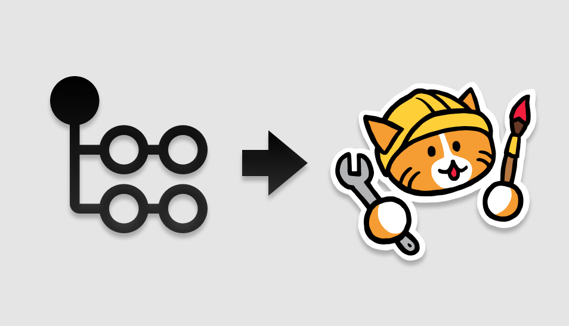

# deploy-to-neocities

[](https://github.com/bcomnes/deploy-to-neocities/actions)

<center></center>

Efficiently deploy a website to [Neocities][nc].

### Pre-requisites
Create a workflow `.yml` file in your repositories `.github/workflows` directory. An [example workflow](#example-workflow) is available below. For more information, reference the GitHub Help Documentation for [Creating a workflow file](https://help.github.com/en/articles/configuring-a-workflow#creating-a-workflow-file).

Get your sites API token and set a [secret][sec] called `NEOCITIES_API_TOKEN`.  Set the `api_token` input on your `deploy-to-neocities` action to `NEOCITIES_API_TOKEN`.

```
https://neocities.org/settings/{{sitename}}#api_key
```

During your workflow, generate the files you want to deploy to [Neocities][nc] into a `dist_dir` directory.  You can use any tools that can be installed or brought into the Github actions environment.

This `dist_dir` should be specified as the `dist_dir` input.  Once the build is complete, the `deploy-to-neocities` action will efficiently upload all new and all changed files to Neocities.  Any files on Neocities that don't exist in the `dist_dir` are considdered 'orphaned' files.  To destrucively remove these 'orphaned' files, set the `cleanup` input to `true`.

You most likely only want to run this on the `master` branch so that only changes commited to `master` result in website updates.

### Example workflow

```yaml
name: Deploy to neociteis

on:
  push:
    branches:
      - master

jobs:
  deploy:
    runs-on: ubuntu-latest

    steps:
    - uses: actions/checkout@v1
    - name: Use Node.js
      uses: actions/setup-node@v1
      with:
        node-version: 12
    - name: Install deps and build
      run: |
        npm i
        npm run build
    - name: Deploy to neocities
      uses: bcomnes/deploy-to-neocities@v1
      with:
        api_token: ${{ secrets.NEOCITIES_API_TOKEN }}
        cleanup: false
        dist_dir: public
```

### Inputs

- `api_token` (**REQUIRED**): The api token for your [Neocities][nc] website to deploy to.
- `dist_dir`: The directory to deploy to [Neocities][nc]. Default: `public`.
- `cleanup`:  Boolean string (`true` or `false`).  If `true`, `deploy-to-neocities` will destructively delete files found on [Neocoties][nc] not found in your `dist_dir`.  Default: `false`.

### Outputs

None.

## See also

- [async-neocities](https://ghub.io/async-neocities): diffing engine used for action.
- [Neocities API Docs](https://neocities.org/api)
- [neocities/neocities-node](https://github.com/neocities/neocities-node): Node api

[qs]: https://ghub.io/qs
[nf]: https://ghub.io/node-fetch
[fd]: https://ghub.io/form-data
[nc]: https://neocities.org
[sec]: https://help.github.com/en/actions/configuring-and-managing-workflows/creating-and-storing-encrypted-secrets
