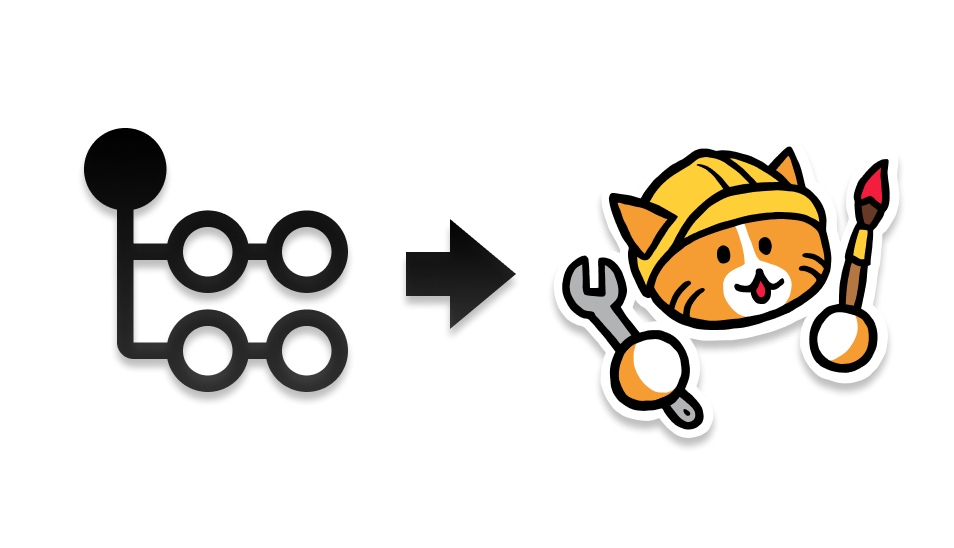

# deploy-to-neocities

[](https://github.com/bcomnes/deploy-to-neocities)
[](https://github.com/bcomnes/deploy-to-neocities/actions)

[](https://github.com/marketplace/actions/deploy-to-neocities)
[![Neocities][neocities-img]](https://deploy-to-neocities.neocities.org)

<center></center>

Efficiently deploy a website to [Neocities][nc] using [Github actions](https://github.com/features/actions).  Uses content aware diffing to only update files that changed.

Alternatively, you can use the bin helper in [async-neocities](https://github.com/bcomnes/async-neocities) to deploy to neocities locally from your own machine as well as in CI.

## Usage

```yaml
name: Deploy to neocities

# only run on changes to main. Use main or master depending on whatever your default branch is called.
on:
  push:
    branches:
      - main

concurrency: # prevent concurrent deploys doing strange things
  group: deploy-to-neocities
  cancel-in-progress: true

jobs:
  deploy:
    runs-on: ubuntu-latest

    steps:
    - uses: actions/checkout@v4
    # Set up any tools and build steps here
    # This example uses a Node.js toolchain to build a site
    - name: Use Node.js
      uses: actions/setup-node@v4
      with:
        node-version: lts/*
    # If you have a different build process, replace this with your own build steps
    - name: Install deps and build
      run: |
        npm i
        npm run build
    # When the dist_dir is ready, deploy it to neocities
    - name: Deploy to neocities
      uses: bcomnes/deploy-to-neocities@v3
      with:
        api_key: ${{ secrets.NEOCITIES_API_TOKEN }}
        cleanup: false
        neocities_supporter: false # set this to true if you have a supporter account and want to bypass unsuported files filter.
        preview_before_deploy: true # print a deployment plan prior to waiting for files to upload.
        dist_dir: public
```

- 💻 [Example YML](.github/workflows/neocities.yml)
- 🌎 [Example Deploy](https://deploy-to-neocities.neocities.org)

Create a workflow `.yml` file in your repository's `.github/workflows` directory. An [example workflow](#example-workflow) is available above. For more information, reference the GitHub Help Documentation for [Creating a workflow file](https://help.github.com/en/articles/configuring-a-workflow#creating-a-workflow-file).

You'll need the API token for your site. Go to:

```
https://neocities.org/settings/{{your-sitename}}#api_key
```

Get your site's API token. In your GitHub repository, set a [secret][sec] called `NEOCITIES_API_TOKEN`.  Set the `api_token` input on your `deploy-to-neocities` action to `${{ secrets.NEOCITIES_API_TOKEN }}` as in the example above.

During your workflow, generate the files you want to deploy to [Neocities][nc] into a directory. Set this as the `dist_dir` directory in your workflow (the default is `public`).  You can use any tools to generate your site that can be installed or brought into the Github actions environment.

Once the build is complete, `deploy-to-neocities` will efficiently upload all new and all changed files to Neocities.  Any files on Neocities that don't exist in the `dist_dir` are considered 'orphaned' files.  To destructively remove these 'orphaned' files, set the `cleanup` input to `true`.

You most likely only want to run this on the `master` branch so that only changes committed to `master` result in website updates.  Running a test build that does not deploy on all branches and PRs can help catch changes that will break the build.

### Inputs

- `api_key` (**REQUIRED**): The API token for your [Neocities][nc] website to deploy to.
- `dist_dir`: The directory to deploy to [Neocities][nc]. Default: `public`. Don't deploy your root repo directory (e.g. `./`). It contains `.git`, `.github` and other files that won't deploy properly to neocities. Keep it clean by keeping or building your site into a subdir and deploy that.
- `neocoties_supporter`: Set this to `true` if you have a paid neocities account and want to bypass the [unsupported files filter](https://neocities.org/site_files/allowed_types).
- `cleanup`:  Boolean string (`true` or `false`).  If `true`, `deploy-to-neocities` will destructively delete files found on [Neocities][nc] not found in your `dist_dir`.  Default: `false`.
- `preview_before_deploy`: Boolean string (`true` or `false`).  If `true`, `deploy-to-neocities` will print a preview of the files that will be uploaded and deleted.  Default: `true`.
- `protected_files`: An optional glob string used to mark files as protected.  Protected files are never cleaned up.  Test this option out with `cleanup` set to false before relying on it.  Protected files are printed when `cleanup` is set to true or false.  Glob strings are processed by [minimatch](https://github.com/isaacs/minimatch) against remote neocities file paths.  Protected files can still be updated.

### Outputs

None.

## FAQ

### Why should I deploy to Neocities?

[Neocities][nc] offers a bunch of nice properties:

- Neocities CDN uses a pure [anycast](https://en.wikipedia.org/wiki/Anycast) network providing efficient content serving no matter where your visitors are located around the world.
- Anycast doesn't require special DNS records to achieve geolocation routing characteristics.  Simple `A` and `AAAA` records are all you need.  Bare names and all!
- Neocities owns its own [ARIN](https://en.wikipedia.org/wiki/American_Registry_for_Internet_Numbers) IP block and has its own [BGP](https://en.wikipedia.org/wiki/Border_Gateway_Protocol) peering agreements, eliminating entire layers of bureaucracy between your content and the rest of the Internet typical of all major cloud providers.
- Far faster cold cache access than other popular static hosting services.  Perfect for personal websites, projects and other infrequently accessed documents.
- Simple and understandable feature set.  You can hand upload and edit files along side built/deployed assets.
- First class IPv6 support.
- Fun, friendly, creative and organic community with an [interesting social network](https://neocities.org/browse).
- Independent, sustainable and altruistic service run by [@kyledrake](https://github.com/kyledrake/) and word on the street is that the service is profitable.
- [Affordable and predictable pricing](https://neocities.org/supporter).  There is a generous free tier and you can get custom domains and additional sites for $5/mo.
- Offers simple, Google-free site analytics.
- Makes accepting tips a breeze.
- Bring your own CI environment, or don't.
- Free https via [Lets Encrypt](https://blog.neocities.org/blog/2016/11/10/switching-to-default-ssl.html).
- Cute cat logo.
- [Support the distributed web](https://neocities.org/distributed-web). Built in IPFS support.
- [Beginner friendly docs](https://neocities.org/tutorials) for learning how to make your own websites.

### What are some of the drawbacks compared to Netlify/Vercel?

- Not appropriate for hyper traffic commercial sites most likely.
- No concept of a Deploy or atomicity when changing files.
- Most features of these services are not included. Neocities is just static file hosting and a few basic features around that.
- Doesn't offer support.
- No deploy previews.
- No Github Deploys API support (yet).

## Sites using deploy-to-neocities

- https://github.com/bcomnes/bret.io ([bret.io](https://bret.io))
- https://github.com/ecomnes/elenacomnes.com ([elenacomnes.comnes](https://elenacomnes.com))
- https://github.com/gumcast/gumcast-client ([gumcast.com](https://gumcast.com))
- https://github.com/bcomnes/deploy-to-neocities/blob/master/.github/workflows/neocities.yml ([deploy-to-neocities.neocities.org](https://deploy-to-neocities.neocities.org))
- [Zambonifofex/stories](https://github.com/Zambonifofex/stories) ([zamstories.neocities.org](https://zamstories.neocities.org))
- [Your Neofeed](https://github.com/victoriadrake/neocities-neofeed), (っ◔◡◔)っ a personal timeline for Neocities and GitHub Pages.
- https://speakscribe.com
- https://geno7.neocities.org
- https://github.com/M1ssM0ss/deploy-to-neocities-template
- https://nelson.neocities.org
- https://flamedfury.com
- https://keb.neocities.org
- https://missmoss.neocities.org
- https://rarebit.neocities.org
- https://cavacado.neocities.org
- https://wanderinginn.neocities.org
- https://andri.dk/blog/2019/2021/deploy-static-websites-anywhere/
- https://github.com/PersonMeetup/frontiercorps ([frontiercorps.neocities.org](https://frontiercorps.neocities.org/))
- https://github.com/riastrad/cyberbspace ([cyberb.space](https://cyberb.space))
- https://github.com/rogerahuntley/neocities-site ([stealdog.neocities.org](https://stealdog.neocities.org))
- https://github.com/ConorSheehan1/conorsheehan1.neocities.org ([conorsheehan1.neocities.org](https://conorsheehan1.neocities.org))
- https://github.com/bechnokid/neocities ([bechnokid.neocities.org](https://bechnokid.neocities.org))
- https://github.com/lime360/website ([lime360.neocities.org](https://lime360.neocities.org))
- https://obspogon.neocities.org/
- https://profsugoi.neocities.org/
- https://github.com/tencurse/neocities ([10kph.neocities.org](https://10kph.neocities.org/))
- https://github.com/alephdfilms/neocities/ ([alephd.neocities.org](https://alephd.neocities.org/)]
- https://sacred.neocities.org/ (https://github.com/M-Valentino/sacredOS)
- https://lenp.net/ (https://github.com/Len42/web-site)
- <https://punkfairie.net> (<https://github.com/punkfairie/punkfairie-site>)
- https://github.com/jefbecker/jefbecker.com ([jefbecker.com](https://jefbecker.com))
- [See more!](https://github.com/bcomnes/deploy-to-neocities/network/dependents)
- ...PR your site when you set it up!

## See also

- [async-neocities](https://ghub.io/async-neocities): diffing engine used for action.
- [Neocities API Docs](https://neocities.org/api)
- [neocities/neocities-node](https://github.com/neocities/neocities-node): Official Node API
- [jonchang/deploy-neocities](https://github.com/jonchang/deploy-neocities): An alternative docker + official ruby client based action similar to this one.
- [M1ssM0ss/deploy-to-neocities-template](https://github.com/M1ssM0ss/deploy-to-neocities-template): a template repo ready for cloning using deploy-to-neocities.
- [professorsugoi/Deploy-Astro-Neocities](https://github.com/professorsugoi/Deploy-Astro-Neocities): a template repo for projets built with Astro. uses deploy-to-neocities.

## CHANGELOG

See [changelog.md](CHANGELOG.md)

[qs]: https://ghub.io/qs
[nf]: https://ghub.io/node-fetch
[fd]: https://ghub.io/form-data
[nc]: https://neocities.org
[sec]: https://help.github.com/en/actions/configuring-and-managing-workflows/creating-and-storing-encrypted-secrets
[neocities-img]: https://img.shields.io/website/https/siteup.neocities.org?label=neocities&logo=data:image/png;base64,iVBORw0KGgoAAAANSUhEUgAAACAAAAAgCAYAAABzenr0AAAAAXNSR0IArs4c6QAAAGhlWElmTU0AKgAAAAgABAEGAAMAAAABAAIAAAESAAMAAAABAAEAAAEoAAMAAAABAAIAAIdpAAQAAAABAAAAPgAAAAAAA6ABAAMAAAABAAEAAKACAAQAAAABAAAAIKADAAQAAAABAAAAIAAAAAAueefIAAACC2lUWHRYTUw6Y29tLmFkb2JlLnhtcAAAAAAAPHg6eG1wbWV0YSB4bWxuczp4PSJhZG9iZTpuczptZXRhLyIgeDp4bXB0az0iWE1QIENvcmUgNS40LjAiPgogICA8cmRmOlJERiB4bWxuczpyZGY9Imh0dHA6Ly93d3cudzMub3JnLzE5OTkvMDIvMjItcmRmLXN5bnRheC1ucyMiPgogICAgICA8cmRmOkRlc2NyaXB0aW9uIHJkZjphYm91dD0iIgogICAgICAgICAgICB4bWxuczp0aWZmPSJodHRwOi8vbnMuYWRvYmUuY29tL3RpZmYvMS4wLyI+CiAgICAgICAgIDx0aWZmOk9yaWVudGF0aW9uPjE8L3RpZmY6T3JpZW50YXRpb24+CiAgICAgICAgIDx0aWZmOlBob3RvbWV0cmljSW50ZXJwcmV0YXRpb24+MjwvdGlmZjpQaG90b21ldHJpY0ludGVycHJldGF0aW9uPgogICAgICAgICA8dGlmZjpSZXNvbHV0aW9uVW5pdD4yPC90aWZmOlJlc29sdXRpb25Vbml0PgogICAgICAgICA8dGlmZjpDb21wcmVzc2lvbj4xPC90aWZmOkNvbXByZXNzaW9uPgogICAgICA8L3JkZjpEZXNjcmlwdGlvbj4KICAgPC9yZGY6UkRGPgo8L3g6eG1wbWV0YT4Kpl32MAAABzBJREFUWAnFVwtwnFUV/v5//31ks5tsE9I8moS0iWETSNKUVpBKDKFQxtrCUIpacHQEGYk16FQHaZ3ajjqjOGWqOKUyMCl2xFoKhQJDBQftpOnAmDZoOyRNjCS1SdO8H5vXPv7rd/7NZvIipQjjmfn23Me555x77rnnv6sppTT8H0n/tG1rmlZIVBG+eW1JBD4t0GA8cYZQcS7ncXL7bFuYPfBJ9mlwtxg3bJoSTvx0tn7LAU48IJNE3GyBj9unrlJC2XRt4vGvLFGGrkXYDxEl03WyDyfRRoiHrxOfiBPU85bovPezi5pHnlmhHq5IsaLAXHhltgPXi+A0VE8X+Dht6lov+uw2rf/8nmIlDjQ+fp1yO/SYnaKYXoOC5QSu8trgddnND7rHv0EvOymwTcbnI867OZ5PLCOKiUIijQgS54nPE3hsfXog2WNY2Z+V5MDXVifjd3/ths/jquL0QyIj9EdC3V6UoLr25KurU73D0ieOEIniKbkc063EduLPRDcR2828/DOpzrbBp0ut3UsEBMe3X2PJuhw2sWHplgjkEViyyBGM93gcf3kkxVP2hNZ1sWfoLg7/jbttJC8jMgiLHHYj4EuIb81I9gQLM92O0iyH+9pUlZSdGDHCJjA0biI/zZ3NxIstsfjKpfFYmROHutYxDwduIo6JAxI6LIq3cSmtpCSg9jF3UsXuix2tHb3L7YZevHRx/FBZvrNzTaEnLTfFQHaSna6CSrghjbVMJzRbtC1KFqC1xT5xAFdnZdxPMcsBS1wpDLHhEoWpiXbj3R8mZ1zoT0Caz677PE4fdDunJYIzd2UtvoKfWwq9+PnRiwgMDd5RX/PGVRIBixLjbNNKpQaP1wO/NzYb47ON0yEzAhUJQjOYJhKFy9DybDcyk+y40DeSdOz5J+5h7CBAxDQdl1k7d5rGHWW74Cz/GdM0gQGSWrMwxTl0VBRSlnSmoblMjIel0zkgN+gKSDFl7G7YMm+C4d8Ix4pvQ4XGPpKC8snQ/vPfvYXiwPuy6tylK3RAFokTpuU/NF8u08dAzbkA/nCylyVeBOanJawJQpcGxjMkB04QdzS0j5ujQVNntZK5BSkwYaIvEEZmQgjm4AeweTOguRah4ZKJdbubeZwKaYl23HptNNQxZeMhE0fqBrDthXZraHTCtKydlF73cFhv67l8FGRnm55sQcGjZ/GTI50IN75kKdMTsywnzMmtj4XmhuDRP13Ag8+2YnA0GrVgWDFmwFld10dN03TXNg2jIMNlKfywn//0BXGyKWBNv904isj5GqjhdmjeJSjMzUDttmUYChpYnS+1ZiY9+IUUrCvxIS/Nic/tbAiOBBkBltoeGn9PRA+c6Jm5Yp5edrIDlWsWw09Ht23IgBrvQ+i9Zy1JcaKE1+zmZTp0c240i7LiwJIPXdPACMnmw9ZriOV2Czu/ES3v7izAdZlx0rw8SQLy/jtu/AEmstfhTP3fcUPRUkS6ziB0eh/M/hZovCkx6ugP4ccvtuO1+gGMMI9IfbGM289j6JSRY/8YEIbmSxM4enoA+2t60MuEm0NyA2xOuL5UDaPgXjQ0NODmW27DgVeOw5a3Dq6Nh2DLWcMnyOjU0v6RME63jloJOjnYZ0VAOozCb8kq4506fG4bOgZCU1fphe/m4osliZNrokwFA3Cs/A7sq6qsgU0bN+LwS9GE9Pv9cLvd8Ofn4Zl7wlC9zXRWSnmUnqvpDVY+1yZ38WgsAjKzX34kNF1DYeQtduLOFT4ceSRvjnFEQrClFMK2/FsIBALYu3evZfw2mxe/Yj1obGzExY4OfPmr98Hu38QCOSGqp+j3tT3RLAZek0SwiMlYxyjIFu6WgX3fzMGNufKonYd49kNGOspLrkdTUxMikQhS4r34tZGDZObEHkccdu3chQ0bNiDc/OoMBQdqe/HOv0aSONhBHJ5yYFLqR+QVoYjyPcT7+mJVLsZ5n988O4gTvHrfX5uKMimjzOJEewhbt25FZ2cnWlpaUF1djdcTR1A6NoH24BiC/E4IKSaiyMuX9OVT/Xh4f5tkn0R+Czc9MOdZzokHLGmuiLPr8qqViqKchqYObcmNvnCeLlajz9+uzGCAOpTiNVabN2+25ETWMAxVV1enzPEBS254X5GqWpsmHwqRkfP4OpdF8y/WmM4psJ3HIVuYMr7n/qwZz6uRp/xq4uQvuSxK4sTBgwfVjh07VH19veInWnW9+j11uDJdlebEj0zqaiC/gSum/gxN3QJOzCA6sIIDv2D0KlhdrWS9Jt2F9aU+FKQ7eeYKi3kaSaur4C29j98lE4P9XWg59z5OnXgDb7/1pvlOY7c5EbYKjug+RFTSeJ90pmi6N/O1KbiKeIqOtJFPhXl6m87OGae8hPoU8SSxaj7dMvahEeCiGUQjcm/LiHLCT8hbUsaGCKk2wqWWNxHykD1LA13kC9JHdmBBLf/D5H8By9d+IkwR5NMAAAAASUVORK5CYII=
